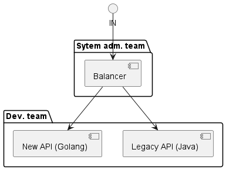

# Description
The team has a number of legacy APIs written in Java.
It was decided to change the stack and rewrite all the APIs to Golang.
After developing the Go version of the API, the team turns to system administrators
with a request to redirect traffic from the legacy API to the new version of the API written in Go.
It should be taken into account that the management of the balancer configs is completely within the
responsibility of the system administrators team.

## Scheme

## Task:
The team wants to implement redirection of the legacy API to the new API without contacting system administrators.

How to do it?

When solving the problem, pay attention to:
* the amount of time that needs to be invested in the proposed solution;
* the presence of a code, a config that needs to be monitored within the framework of the proposed solution.
