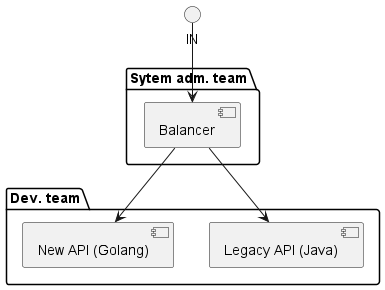

# Описание
У команды есть ряд Legacy API, написанных на Java.
Было решено изменить стек и переписать все API на Golang.
После разработки новой версии API на Go, команда обращается к системным администраторам
с просьбой перенаправить трафик с Legacy API на новую версию API.
Следует принять во внимание, что управление конфигурациями балансировщика полностью входит в
компетенцию команды системных администраторов.

## Схема

## Задача:
Команда хочет реализовать перенаправление c Legacy API на новый API без обращения к системным администраторам.

Как это сделать?

При решении проблемы обратите внимание на:
* количество времени, которое необходимо потратить в предлагаемое решение;
* наличие кода, конфигурации, которую необходимо отслеживать в рамках предлагаемого решения.